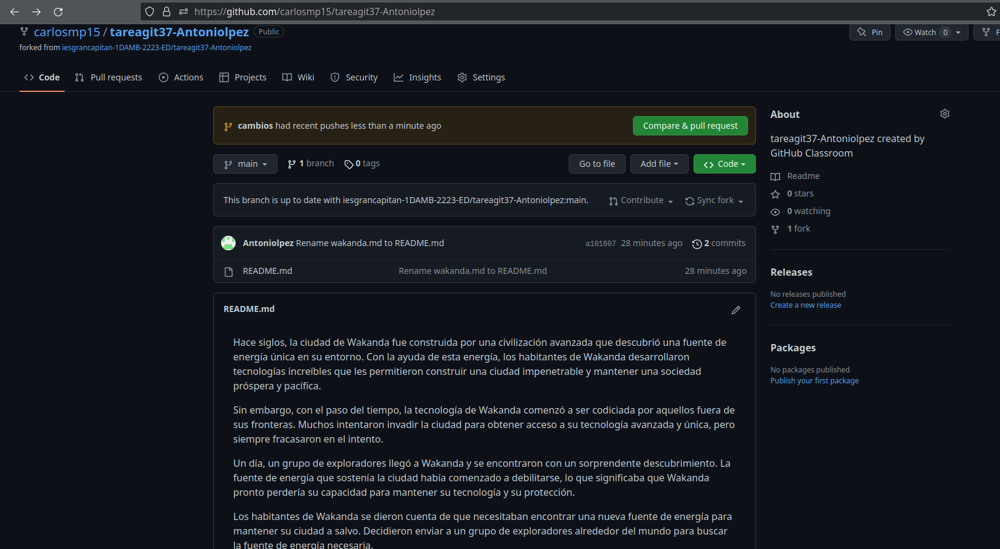

## TAREA GIT 3.7

#### Principal - Secuencia Introducida.

**1)**
Realizaremos un fork del repositorio.

**2)**
Clonamos el repositorio.

**3)**
Añadimos cambios. (He creado un nuevo archivo "texto.md")

**4)**
Añadimos una nueva rama para incluir los cambios.

Añadimos el nuevo fichero creado.

Por último realizamos un commit.

**5)**
Subimos los cambios en remoto a la nueva rama de cambios.

**6)**
Si accedemos al Github veremos como hay un nuevo pull request.

**7)**
Ya solo tendríamos que aceptar el cambio sugerido por la otra persona.

**8)**
Creamos un tag a partir de un commit ya creado.

Tenemos que usar el id del commit.

**9)**
Subimos los cambios asignándoselo al tag "v1.0".

**10)**
Clonamos el repositorio desde el tag creado.

